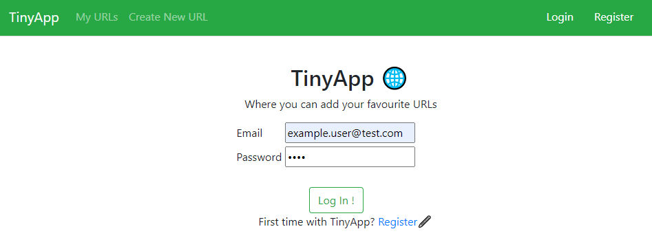
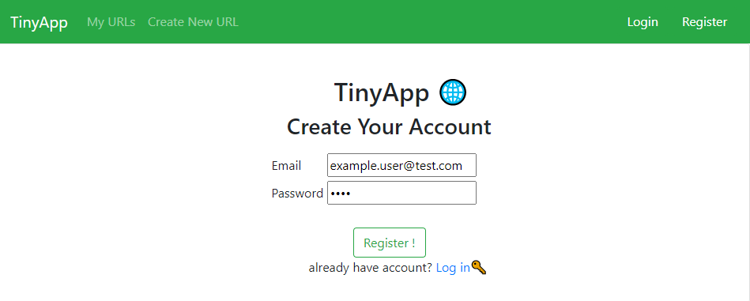
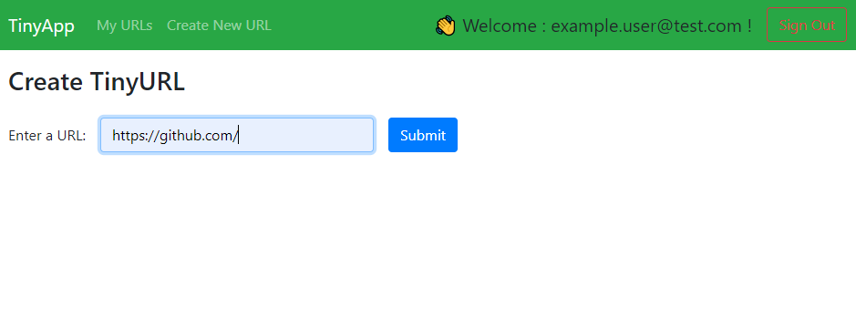
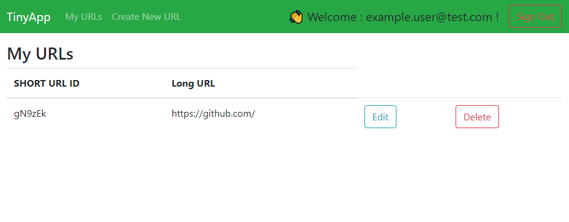

# TinyApp Project

TinyApp is a full stack web application built with Node and Express that allows users to shorten long URLs (à la bit.ly).

## Final Product

*Log in page showcase*

*Registration page showcase*

*Creating New URL page showcase*

*Main page showcase after created new URL*

## Dependencies

- Node.js
- Express
- EJS
- bcryptjs
- cookie-session

## Dev Dependencies

- chai (Test purposes)
- mocha (Test purposes)
- nodemon (optional but helpful tool fo running the app easier by using the `npm start` command instead of the `node express_server.js`)

## Getting Started

- Install all dependencies (using the `npm install` command).
- Run the development web server using the `node express_server.js` command or `npm start` if `nodemon` is installed
